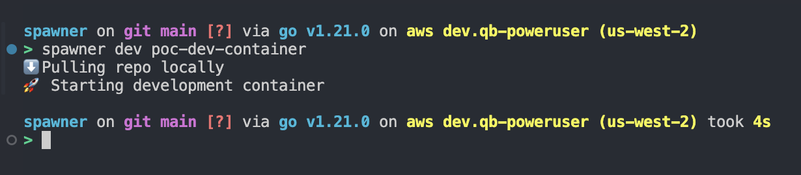

# SPAWNER

Spawn VSCODE development containers after defining them in a `configuration.yaml` file:

```yaml
devContainers:
  reposPath:
    - /Users/mbozhilov/Documents/Other/spawner/repos # where to pull repos locally
  containers:
    poc-dev-container:
    - git@github.com:asynchroza/poc-dev-container-next-linter.git
```



## Requirements

* You need to install the [devcontainers cli tool](https://github.com/devcontainers/cli).
You can do that by running `spawner install-devcontainers` ([npm](https://docs.npmjs.com/cli/v10/commands/npm) is required)
